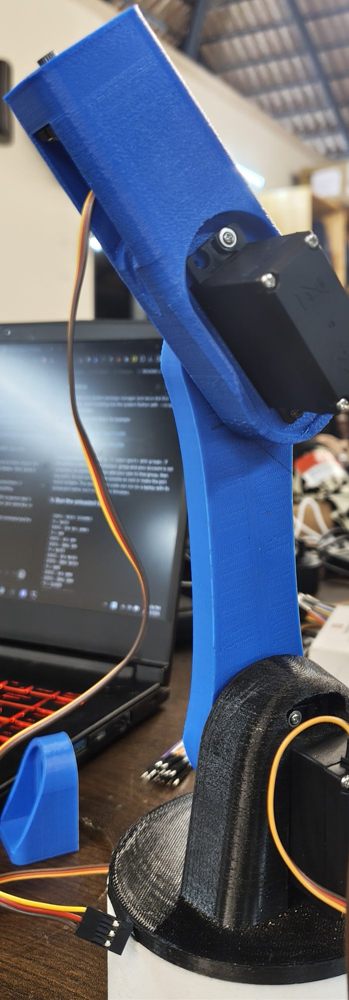
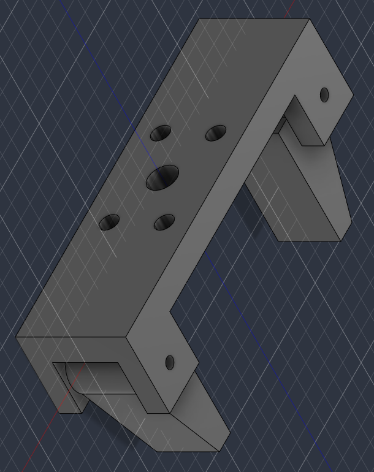
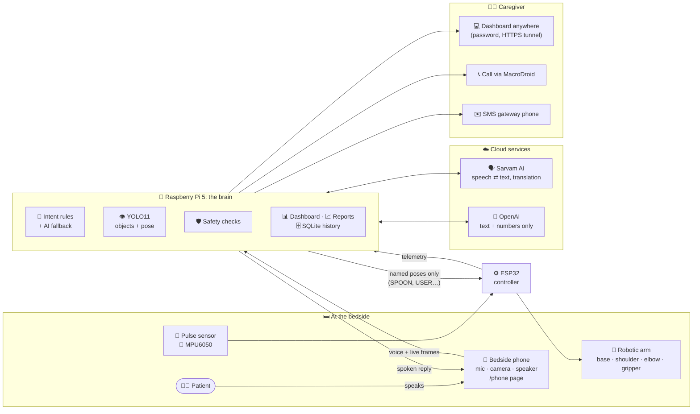
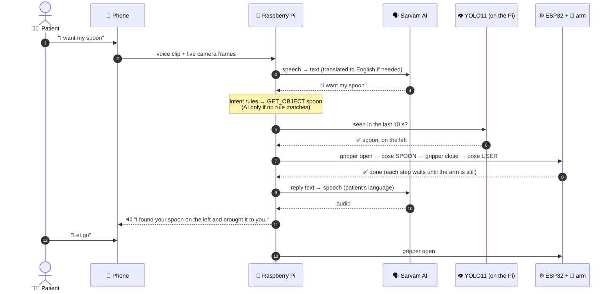
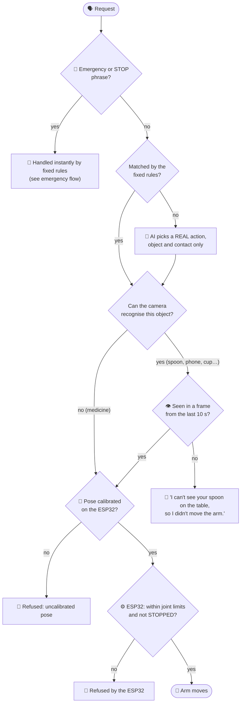
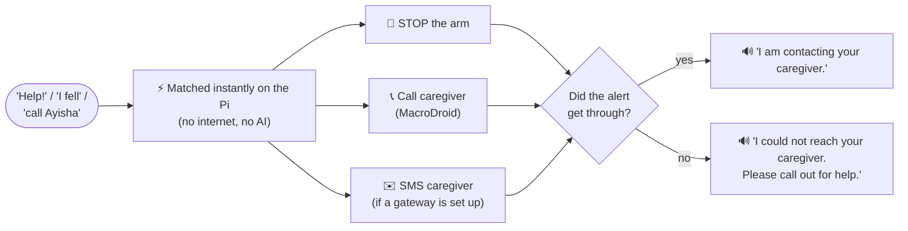
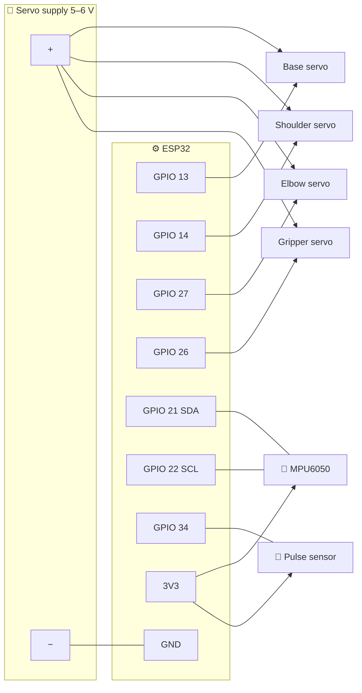
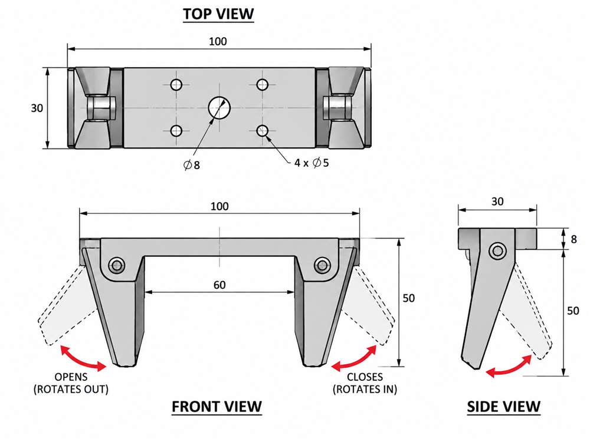

# 🛏️🤖 Bedside Assistant

**A voice-controlled robotic arm and caregiver link for people who can't easily move.**

&nbsp;&nbsp;

---

## 💡 The problem

For someone who is bedridden, partly paralysed or in a wheelchair, everyday things are out of
reach: a glass of water, their medicine, their phone, a spoon. Asking for each one makes them
dependent on someone always being in the room, and a caregiver who steps out has no idea how
the patient is doing.

**The Bedside Assistant sits next to the bed.** The patient just speaks, in English or their own
Indian language, and a small robotic arm fetches what they need. A camera checks the object is
really there, the assistant answers out loud, and the caregiver gets a live dashboard, daily
activity reports and an immediate phone call if the patient says "help".

> ⚠️ **Hackathon prototype. Not a medical device:** it never diagnoses anything, and its pulse
> reading comes from a hobby sensor.

---

## ✨ What it does

| | |
|---|---|
| 🗣️ **Talk naturally** | "I want spoon", "can you get me something to drink", "where is my phone?" in English, Malayalam, Hindi, Tamil and other Indian languages. Replies are spoken back in the same language. |
| 🦾 **Fetch objects** | The arm opens its gripper, goes to the object's spot, grips it and holds it out to the patient. "Let go" releases it. |
| 👁️ **See the table** | A phone camera on a bedside stand runs live object detection. The arm only moves for an object the camera actually sees, and "where is my phone?" gets "on the left, next to the laptop". |
| 🚨 **Help in one word** | "Help", "I fell" or "call Ayisha" stops the arm instantly and phones the caregiver, hands-free. |
| 📊 **Caregiver dashboard** | Live camera picture, whether the patient is lying or sitting up, when they last moved, pulse, and every request and alert. Works from anywhere, behind a password. |
| 📈 **Activity reports** | Compares today with yesterday ("moved in 42% of checks, up from 30%") with a 7-day chart and a plain-language AI summary for the family. |

---

## 🧭 How it works

- The **phone** replaces a separate camera, microphone and speaker: it just opens a web page served by the Pi.
- The **Raspberry Pi** does all the thinking. It runs vision on its own CPU, so **camera pictures never leave the Pi**.
- The **ESP32** owns the motors. The Pi only asks for named poses (`SPOON`, `USER`, …), and the ESP32 checks them against each joint's safe limits, so no bug or bad request upstream can drive a servo into the bed.

### 🎙️ One request, end to end: *"I want my spoon"*

### 🛡️ When does the arm actually move?

Every fetch must pass **all** of these checks. Fail any one and the arm stays still and the patient
is told why.

### 🚨 Emergency flow

The stop and the alert run **in parallel**, so an unreachable ESP32 can never delay the call.
After a STOP the arm refuses every motion until someone explicitly resumes it.

---

## 📁 Repository

| Folder | What |
|---|---|
| 🍓 [`raspberry_pi/`](raspberry_pi/) | The brain: Python/FastAPI server, phone page, dashboard, reports. [Setup and details →](raspberry_pi/README.md) |
| ⚙️ [`esp32_controller/`](esp32_controller/) | Arm and sensor firmware (Arduino), with a browser calibration page. [Wiring and details →](esp32_controller/README.md) |
| 🦾 [`gripper_cad/`](gripper_cad/) | 3D-printable two-jaw gripper: ready STL/STEP files and the parametric Fusion 360 script |
| 🖼️ [`docs/images/`](docs/images/) | Photos and renders used in this README |

---

## 🔧 Hardware

| Part | Notes |
|---|---|
| 🍓 Raspberry Pi 5 (4 GB+) | Runs everything on the CPU, no accelerator needed |
| ⚙️ ESP32 Dev Module | Arm and sensor controller (Wi-Fi is **2.4 GHz only**) |
| 🦾 3-joint arm + gripper, 4 hobby servos | e.g. MG996R joints, SG90 gripper; separate 5–6 V, ≥3 A supply |
| 🖨️ 3D-printed gripper | [`gripper_cad/export/`](gripper_cad/export/) |
| 📱 Android phone on a bedside stand | Camera, microphone, speaker; MacroDroid for hands-free calls |
| 💓 MPU6050, analog pulse sensor | Optional, for the dashboard |

### 🔌 Wiring

| Part | ESP32 pin |
|---|---|
| Base / shoulder / elbow servo signal | **GPIO 13 / 14 / 27** |
| Gripper servo signal | **GPIO 26** |
| Servo red (+) / brown (−) | **external 5–6 V supply**, never the ESP32 |
| MPU6050 VCC / GND / SDA / SCL | **3V3** / GND / **GPIO 21** / **GPIO 22** |
| Pulse sensor + / − / S | **3V3** (not 5 V) / GND / **GPIO 34** |
| Optional STOP button | any free pin to GND (`STOP_BUTTON_PIN`) |

> 🔌 **Join all grounds:** servo supply −, every servo's brown wire, the sensor GNDs and the ESP32 GND.
> Without a common ground the servos won't move.
>
> ⚡ **Never power servos from the ESP32's VIN / 5V / 3V3.** Their current spikes reset the board and can
> stop it reading its own flash.

---

## 🚀 Quick start

1. 🍓 **Raspberry Pi:** follow [raspberry_pi/README.md](raspberry_pi/README.md#setup). With
   `MOCK_HARDWARE=true` the whole system runs with a simulated arm, so you can try it without any hardware.
2. ⚙️ **ESP32:** wire it and upload the firmware as in [esp32_controller/README.md](esp32_controller/README.md),
   then calibrate the poses in a browser at `http://<ESP32 IP>/calibrate` and put the ESP32's
   IP in the Pi's `.env`.
3. 📱 **Phone:** open `https://<Pi IP>:8443/phone`, allow camera and microphone, point it at the table.
4. 👩‍⚕️ **Caregiver:** open `http://<Pi IP>:8000/dashboard`, or `scripts/start.sh --online` for a link that works anywhere.

---

## 🎬 Demo

| Say | What happens |
|---|---|
| 👁️ "Where is my spoon?" | "I can see your spoon on the left, next to the laptop." |
| 🦾 "I want spoon" | The arm opens, goes to the spoon, grips it and holds it out: "I found your spoon on the left and brought it to you." |
| ✋ "Let go" | The gripper releases the spoon |
| 🌏 (in Malayalam) "എന്റെ ഫോൺ എവിടെ?" | Understood as "Where is my phone?" and answered in Malayalam |
| 🙅 "Bring me my phone" when it isn't on the table | "I can't see your phone on the table, so I didn't move the arm." |
| 🚨 "Help" | The arm freezes and the bedside phone calls the caregiver on speaker |
| 📈 Caregiver opens `/report` | "More active: moved in 43% of checks, compared with 30% the day before" plus an AI summary |

---

## 🛡️ Safety and privacy

- 🚨 **Emergency and STOP are matched instantly on the Pi**, with fixed replies. They never wait
  for the internet or the AI, and an emergency stops the arm and alerts the caregiver in parallel.
- 🦾 **The arm only moves for a reason:** the object must be visible in a recent camera frame, its
  pose must be calibrated, and the ESP32 enforces joint limits and refuses all motion after a STOP.
  Every step waits for the arm to be still, so a STOP is never queued behind a move.
- 🤖 **The AI is boxed in.** It only sees sentences the rules can't match, can only choose real
  actions, objects and contacts, and rewrites replies from what actually happened. If it fails,
  the fixed rules and replies take over.
- 🔒 **Privacy:** camera pictures stay on the Pi; the history stores numbers only; OpenAI receives
  text and numbers, never images. Every page sits behind a password.
- 🩺 **No diagnoses:** reports describe activity ("more active than yesterday") and never say a
  patient is improving or getting worse. Changes are flagged for the doctor or nurse.

---

## 🧰 Built with

Python · FastAPI · Ultralytics YOLO11 (detection + pose) · Sarvam AI (speech-to-text,
translation, text-to-speech for Indian languages) · OpenAI (`gpt-5.4-mini`) · SQLite ·
ESP32 / Arduino · MacroDroid · Cloudflare Tunnel · Fusion 360

✅ 248 automated tests on the Pi software, with no hardware or internet needed: `python -m pytest -q`

---

## 📌 Status and limitations

- ✅ **Working end to end on real hardware:** voice in English and Malayalam (spoken reply in
  Malayalam), live detection, camera-checked fetching with the arm, dashboard and reports.
- 📞 **Calls:** the Pi reaches MacroDroid on the bedside phone, which places the call; a full
  "help" call to the caregiver still needs a final check on the day.
- ⏱️ **Response time:** about 3–5 s in English; up to about 10 s for other languages, because
  speech recognition, the AI reply, translation and speech are each a network call. Emergency
  and STOP don't wait for the AI.
- 📍 **Fixed object spots:** the arm goes to calibrated positions, so each object has its place on
  the table. It doesn't plan a path to wherever the object is.
- 💊 **Medicine isn't recognised** by the general-purpose YOLO model. It's fetched from its spot
  without a camera check; a custom-trained model would fix that.
- 🥄 **Spoons and other small, shiny objects** are detected less reliably than bottles or phones.
  A steady camera and a plain background help.
- 📐 **Our MPU6050 is a clone** (chip ID 0x70) whose accelerometer returns zeros, so the dashboard
  shows motion as unavailable. A genuine MPU6050 works without code changes.
- ✉️ **SMS** needs an Android gateway phone; without one, messages are only logged. Calls work through MacroDroid.

---

## 🩹 Troubleshooting

| Problem | Fix |
|---|---|
| 📶 ESP32 can't find the Wi-Fi | It's 2.4 GHz only, and phone hotspots often switch to 5 GHz. Check the exact network name, including trailing spaces |
| 🦾 Servos don't move | No common ground, or no external servo power |
| 🔁 ESP32 keeps resetting / `flash read err` | Servos are powered from the ESP32. Move them to the external supply |
| ⏳ Upload stuck at `Connecting…` | Hold **BOOT** while it connects. If long uploads keep dropping, use `esp32_controller/tools/upload_chunked.ps1` |
| 🎤 Phone page has no microphone | Use the **https** address (`:8443`); browsers block the mic on plain http |
| 🔌 "The robotic arm is currently unavailable" | Check `ESP32_CONTROLLER_URL`; the ESP32's IP can change when the hotspot restarts |

---

## 🗺️ Roadmap

- 🧩 **Table zones:** YOLO picks which zone of the table an object is in, and the arm uses that zone's calibrated pose
- 💊 **Custom YOLO model** for medicine boxes and blister packs
- 📡 **Wi-Fi (OTA) firmware updates** for the ESP32, so no USB or BOOT button is needed
- 🎯 **Full positioning:** table-plane camera calibration (ArUco markers) + inverse kinematics, inside a safe boundary

---

## 🦾 Gripper

  

Print `gripper_cad/export/Base.stl`, `Jaw_Left.stl` and `Jaw_Right.stl` in one job (PLA or PETG,
0.2 mm layers, 3–4 walls, 30–40 % infill, no supports; base plate-side down, jaws on their side).
Assemble with 2 × M3×35 bolts and nyloc nuts.

To change the dimensions, edit `gripper_cad/fusion_script/params.json`, copy the `fusion_script`
folder into Fusion 360's Scripts folder as `GripperCAD`, set `output_dir` to a folder on your
machine, and run it from **Utilities → Add-Ins**.
